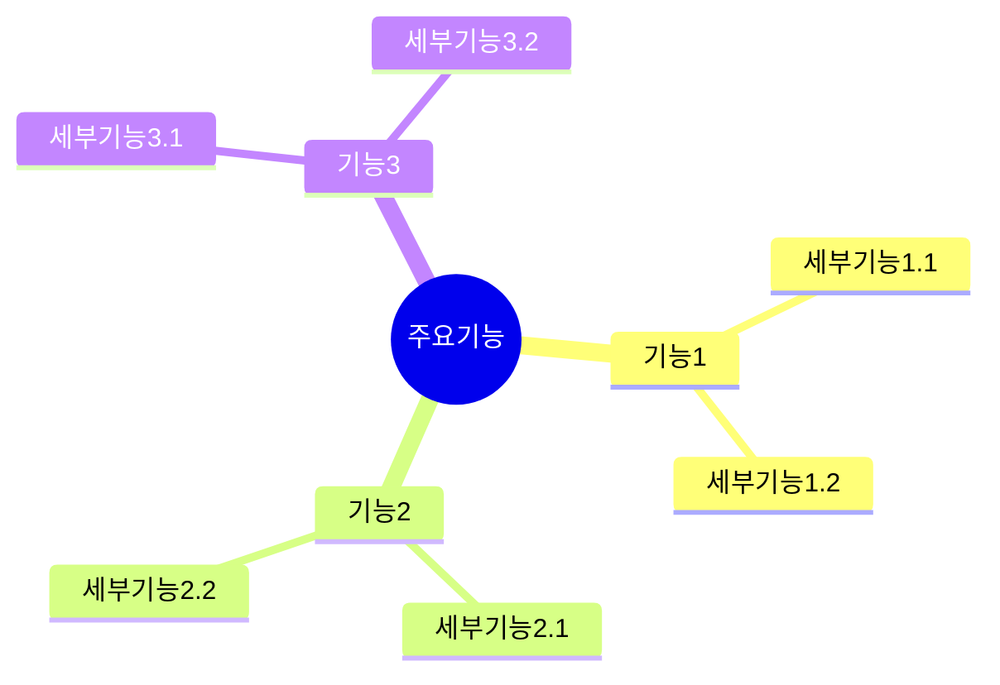
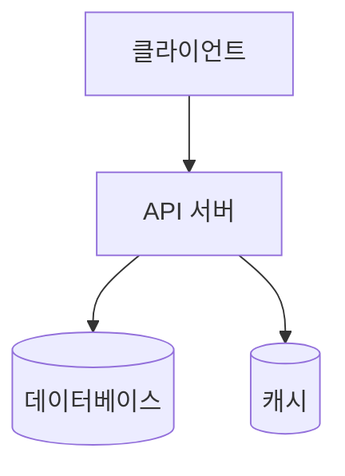
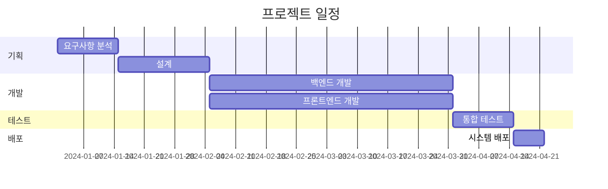

# 프로젝트 제안서 [Project Proposal]

## 1. 프로젝트 개요(Project Overview)
### 1.1. 프로젝트 명(Project Name)
- 프로젝트명: [프로젝트명]
- 프로젝트 기간: YYYY.MM.DD - YYYY.MM.DD

### 1.2. 배경 및 목적(Background & Purpose)
- 프로젝트의 추진 배경
- 해결하고자 하는 문제점
- 달성하고자 하는 목적

### 1.3. 프로젝트 범위(Project Scope)
- 개발 범위
- 제외 범위

## 2. 프로젝트 상세(Project Details)
### 2.1. 주요 기능(Key Features)

### 2.2. 시스템 구성도(System Architecture)

## 3. 프로젝트 추진 계획(Project Implementation Plan)
### 3.1. 추진 일정(Schedule)

### 3.2. 투입 인력(Project Team)
| 역할 | 인원 | 담당 업무 | 투입 기간 |
|-----|-----|----------|-----------|
| PM | 1명 | 프로젝트 관리 | 6개월 |
| 백엔드 개발자 | 2명 | API 서버 개발 | 4개월 |
| 프론트엔드 개발자 | 2명 | 웹 클라이언트 개발 | 4개월 |
| DBA | 1명 | 데이터베이스 설계/관리 | 2개월 |

## 4. 소요 예산(Budget)
### 4.1. 예산 내역(Budget Details)
| 항목 | 금액 | 비고 |
|-----|-----|------|
| 인건비 | 000,000,000원 | PM, 개발자, DBA |
| 하드웨어 | 00,000,000원 | 서버, 개발장비 |
| 소프트웨어 | 00,000,000원 | 라이선스 |
| 기타 | 0,000,000원 | 예비비 |
| 총계 | 000,000,000원 | |

## 5. 기대효과 및 위험분석(Expected Benefits & Risk Analysis)
### 5.1. 기대효과(Expected Benefits)
- 정량적 기대효과
  - 운영비용 절감: 연간 XX%
  - 업무 처리 시간: XX% 단축
- 정성적 기대효과
  - 사용자 만족도 향상
  - 업무 효율성 증대

### 5.2. 위험분석(Risk Analysis)
| 위험요소 | 발생가능성 | 영향도 | 대응방안 |
|---------|-----------|--------|----------|
| 일정 지연 | 중 | 상 | - 주간 진척 관리 - 이슈 조기 발견 |
| 기술적 난제 | 중 | 중 | - 사전 기술 검증 - 대체 기술 준비 |
| 보안 위험 | 하 | 상 | - 보안 전문가 검토 - 정기적인 보안 점검 |

## 6. 첨부 자료(Attachments)
### 6.1. 참고 자료(References)
- 시장 분석 보고서
- 기술 검토 문서
- 유사 사례 분석

### 6.2. 용어 정의(Terminology)
| 용어 | 설명 |
|-----|------|
| API | Application Programming Interface |
| DBA | Database Administrator |