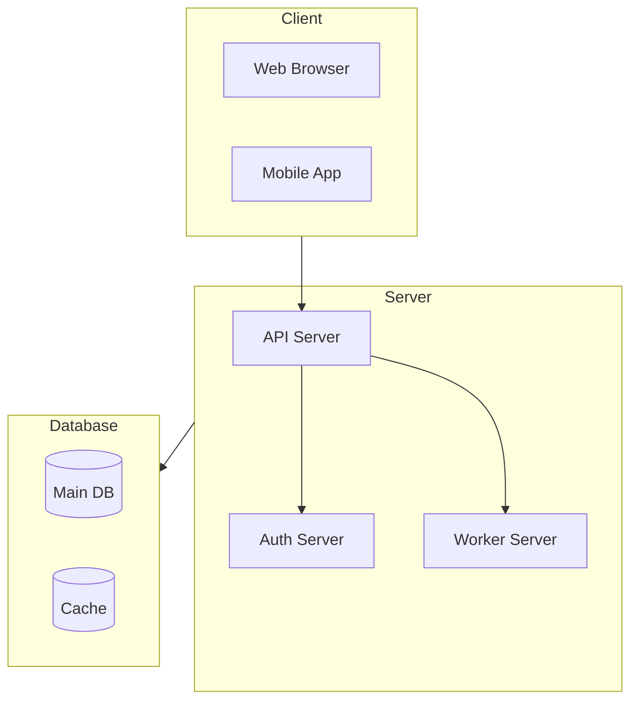
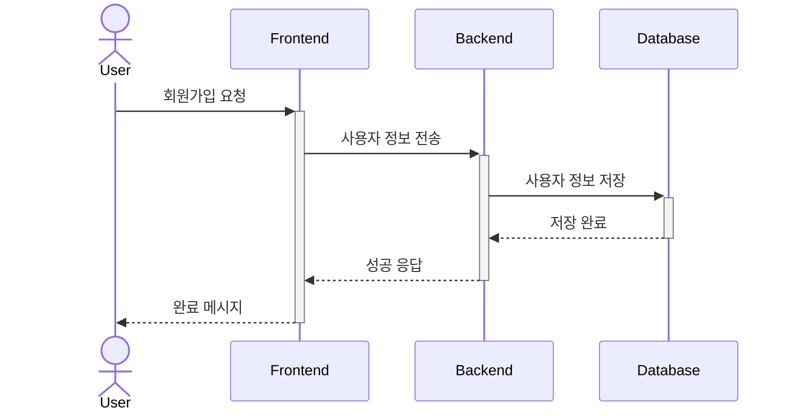
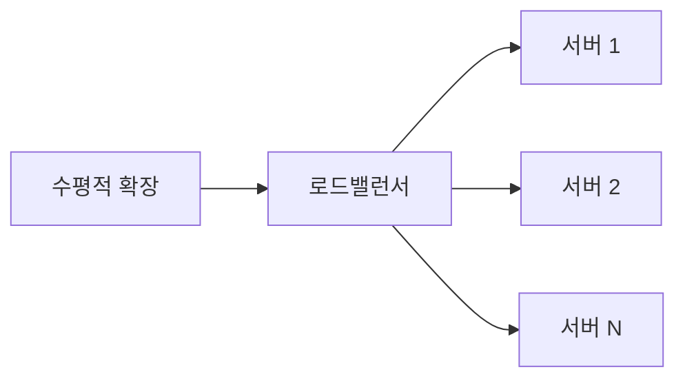

# 요구사항 명세서 [Software Requirements Specification]

## 문서 이력(Document History)
| 버전 | 날짜 | 작성자 | 승인자 | 변경내용 |
|-----|------|--------|--------|----------|
| 1.0 | 2024.03.15 | 홍길동 | 김철수 | 최초 작성 |

## 1. 개요(Introduction)
### 1.1. 목적(Purpose)
본 문서는 [프로젝트명] 개발을 위한 요구사항을 정의한다.

### 1.2. 범위(Scope)
- 웹 애플리케이션 개발
- 사용자 관리 시스템
- 데이터 분석 대시보드

### 1.3. 용어 정의(Definitions)
| 용어 | 설명 |
|-----|------|
| JWT | JSON Web Token |
| SSO | Single Sign On |

## 2. 시스템 개요(System Overview)
### 2.1. 시스템 구성도(System Architecture)


### 2.2. 사용자 정의(User Definition)
| 사용자 유형 | 설명 | 권한 수준 |
|------------|------|-----------|
| 관리자 | 시스템 전체 관리 | 전체 권한 |
| 일반 사용자 | 서비스 이용자 | 제한된 권한 |
| 게스트 | 비회원 사용자 | 최소 권한 |

## 3. 기능적 요구사항(Functional Requirements)
### 3.1. 사용자 관리(User Management)
#### 3.1.1. 회원가입(Sign Up)
- 우선순위: 높음
- 설명: 신규 사용자 등록 프로세스


#### 3.1.2. 로그인(Login)
- 우선순위: 높음
- 설명: 사용자 인증 프로세스
- 요구사항 상세:
  - 이메일/비밀번호 로그인
  - 소셜 로그인(Google, GitHub)
  - 2단계 인증(선택)

### 3.2. 데이터 관리(Data Management)
#### 3.2.1. 데이터 입력(Data Input)
- 우선순위: 중간
- 설명: 사용자 데이터 입력 및 검증
- 유효성 검사 규칙:
```json
{
    "name": "최소 2자, 최대 50자",
    "email": "이메일 형식",
    "phone": "숫자와 '-' 만 허용"
}
```

## 4. 비기능적 요구사항(Non-functional Requirements)
### 4.1. 성능 요구사항(Performance Requirements)
| 항목 | 요구사항 | 측정 방법 |
|-----|----------|-----------|
| 응답시간 | 평균 300ms 이하 | APM 도구 |
| 동시접속자 | 1000명 이상 | 부하 테스트 |
| 가용성 | 99.9% | 모니터링 도구 |

### 4.2. 보안 요구사항(Security Requirements)
- 데이터 암호화
  - 전송 구간: TLS 1.3
  - 저장 데이터: AES-256
- 접근 제어
  - RBAC(Role Based Access Control)
- 보안 감사
  - 모든 중요 작업 로깅

### 4.3. 확장성 요구사항(Scalability Requirements)


## 5. 인터페이스 요구사항(Interface Requirements)
### 5.1. 사용자 인터페이스(User Interface)
- 반응형 웹 디자인
- 다크모드 지원
- 접근성 준수(WCAG 2.1)

### 5.2. 외부 시스템 인터페이스(External System Interface)
| 시스템 | 통신방식 | 데이터 형식 |
|--------|----------|-------------|
| 결제 시스템 | REST API | JSON |
| 알림 서비스 | WebSocket | JSON |

## 6. 제약사항(Constraints)
### 6.1. 기술적 제약사항(Technical Constraints)
- Node.js v16 이상
- MongoDB v4.4 이상
- Docker 지원

### 6.2. 법적 제약사항(Legal Constraints)
- 개인정보보호법 준수
- GDPR 준수
- 접근성 지침 준수

## 7. 부록(Appendix)
### 7.1. 참고 문서(References)
- UI/UX 가이드라인
- API 문서
- 데이터베이스 스키마

### 7.2. 승인(Approval)
| 역할 | 이름 | 서명 | 날짜 |
|-----|------|------|------|
| 기획자 | | | |
| 개발책임자 | | | |
| PM | | | |
