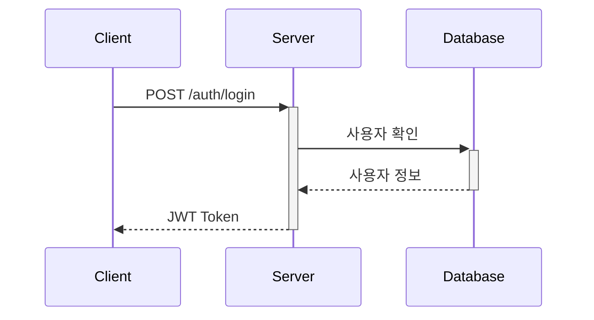

# API 문서 [API Documentation]

## 1. API 개요(API Overview)
### 1.1. 기본 정보
- 기본 URL: `https://api.example.com/v1`
- 인증 방식: Bearer Token
- 응답 형식: JSON

### 1.2. 공통 응답 형식
```json
{
    "status": "success|error",
    "data": {},
    "message": "응답 메시지",
    "timestamp": "2024-03-15T09:00:00Z"
}
```

## 2. 인증(Authentication)
### 2.1. 로그인 API


#### Request
```json
{
    "email": "user@example.com",
    "password": "password123"
}
```

#### Response
```json
{
    "status": "success",
    "data": {
        "token": "eyJhbGciOiJ...",
        "expires_in": 3600
    }
}
```

## 3. 사용자 관리(User Management)
### 3.1. 엔드포인트 목록
| Method | Endpoint | 설명 |
|--------|----------|------|
| GET | /users | 사용자 목록 조회 |
| POST | /users | 사용자 생성 |
| PUT | /users/:id | 사용자 정보 수정 |