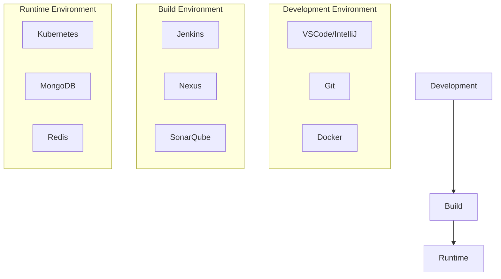
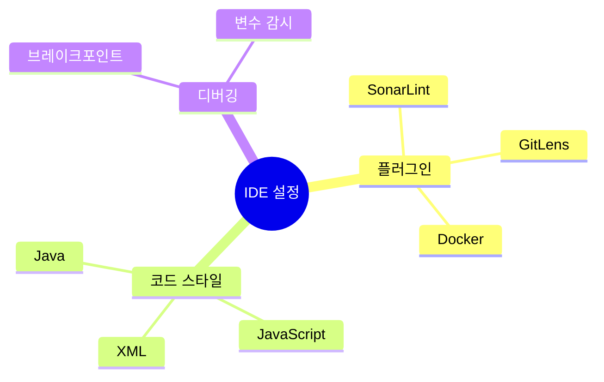
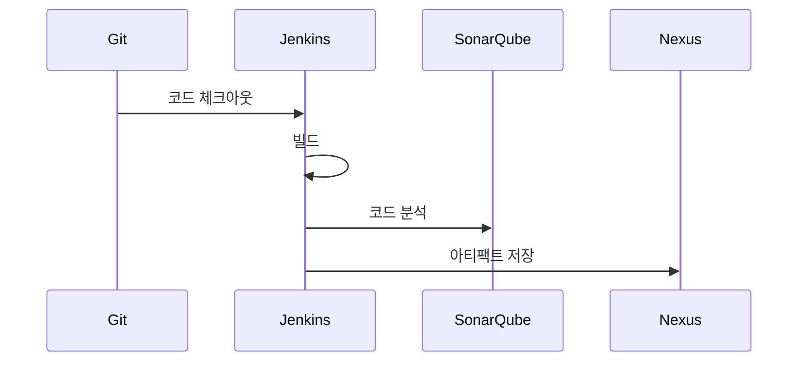
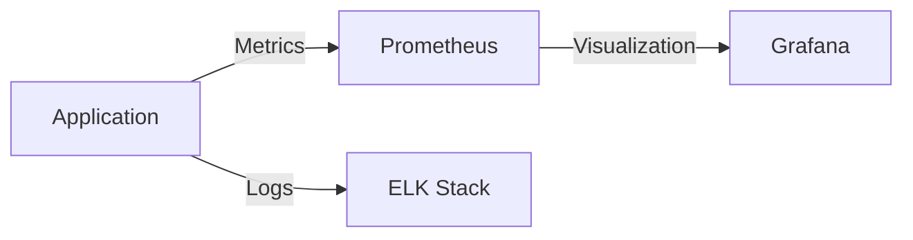
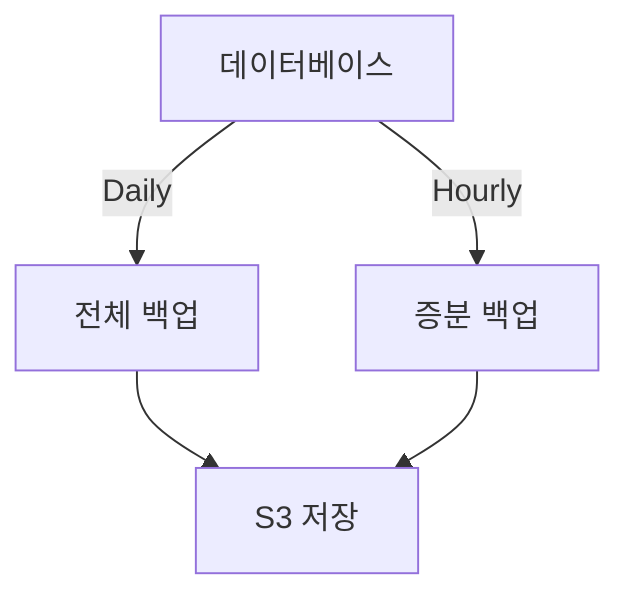
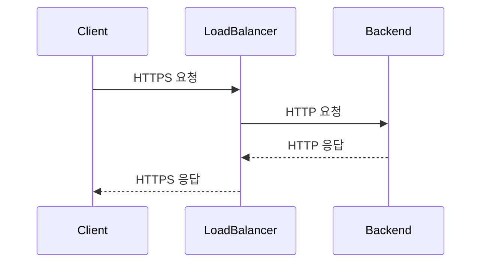
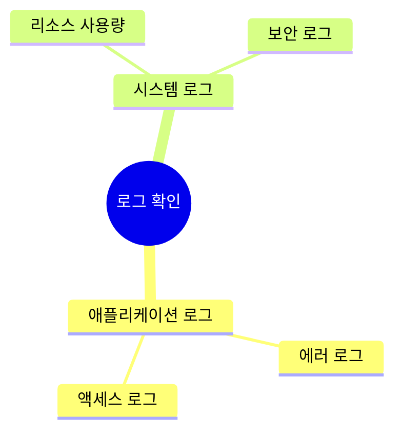

# 환경 설정 가이드 [Environment Setup Guide]

## 문서 이력(Document History)
| 버전 | 날짜 | 작성자 | 승인자 | 변경내용 |
|-----|------|--------|--------|----------|
| 1.0 | 2024.03.15 | 홍길동 | 김철수 | 최초 작성 |

## 1. 개요(Overview)
### 1.1. 목적(Purpose)
본 문서는 [프로젝트명]의 개발 및 운영 환경 구성을 위한 가이드를 제공한다.

### 1.2. 시스템 아키텍처(System Architecture)


## 2. 개발 환경 설정(Development Environment Setup)
### 2.1. 필수 소프트웨어(Required Software)
| 소프트웨어 | 버전 | 용도 |
|------------|------|------|
| JDK | 17.0.2 | Java 개발 |
| Node.js | 18.15.0 | Frontend 개발 |
| Docker | 24.0.6 | 컨테이너 환경 |
| Git | 2.40.0 | 형상관리 |

### 2.2. IDE 설정(IDE Setup)


## 3. 로컬 개발 환경(Local Development Environment)
### 3.1. Docker Compose 구성
```mermaid
yaml
version: '3.8'
services:
  mongodb:
    image: mongo:6.0
    ports:
      - "27017:27017"
   
  redis:
    image: redis:7.0
    ports:
      - "6379:6379"
     
  application:
    build: .
    ports:
      - "8080:8080"
    depends_on:
      - mongodb
      - redis
```

### 3.2. 환경 변수 설정(Environment Variables)
```mermaid
dotenv
# Application
APP_PORT=8080
APP_ENV=local

# Database
DB_HOST=localhost
DB_PORT=27017
DB_NAME=myapp

# Redis
REDIS_HOST=localhost
REDIS_PORT=6379
```

## 4. 빌드 환경 설정(Build Environment Setup)
### 4.1. Jenkins 파이프라인(Jenkins Pipeline)


### 4.2. 빌드 스크립트(Build Script)
```mermaid
groovy
pipeline {
    agent any
    stages {
        stage('Checkout') {
            steps {
                git 'https://github.com/org/repo.git'
            }
        }
        stage('Build') {
            steps {
                sh './gradlew build'
            }
        }
        stage('Test') {
            steps {
                sh './gradlew test'
            }
        }
    }
}
```

## 5. 운영 환경 설정(Production Environment Setup)
### 5.1. Kubernetes 구성(Kubernetes Configuration)
```mermaid
yaml
apiVersion: apps/v1
kind: Deployment
metadata:
  name: myapp
spec:
  replicas: 3
  selector:
    matchLabels:
      app: myapp
  template:
    metadata:
      labels:
        app: myapp
    spec:
      containers:
      - name: myapp
        image: myapp:1.0
        ports:
        - containerPort: 8080
```

### 5.2. 모니터링 설정(Monitoring Setup)


## 6. 데이터베이스 설정(Database Setup)
### 6.1. MongoDB 설정
```json
{
  "mongodb": {
    "replication": {
      "replSetName": "rs0"
    },
    "security": {
      "authorization": "enabled"
    },
    "storage": {
      "dbPath": "/data/db"
    }
  }
}
```

### 6.2. 백업 설정(Backup Configuration)


## 7. 보안 설정(Security Setup)
### 7.1. SSL/TLS 설정


### 7.2. 방화벽 설정(Firewall Configuration)
| 출발지 | 목적지 | 포트 | 프로토콜 |
|--------|--------|------|-----------|
| Any | LoadBalancer | 443 | HTTPS |
| Internal | MongoDB | 27017 | TCP |
| Internal | Redis | 6379 | TCP |

## 8. 문제 해결 가이드(Troubleshooting Guide)
### 8.1. 일반적인 문제(Common Issues)
| 문제 | 원인 | 해결 방법 |
|------|------|-----------|
| 빌드 실패 | 의존성 문제 | gradle clean |
| 연결 오류 | 네트워크 설정 | 방화벽 확인 |

### 8.2. 로그 확인(Log Checking)


## 9. 참고 자료(References)
### 9.1. 문서 목록(Document List)
- 시스템 아키텍처 문서
- API 문서
- 운영 매뉴얼

### 9.2. 유용한 명령어(Useful Commands)
```bash
# Docker 컨테이너 상태 확인
docker ps

# Kubernetes 파드 상태 확인
kubectl get pods

# 로그 확인
kubectl logs <pod-name>

# 데이터베이스 백업
mongodump --out /backup
```