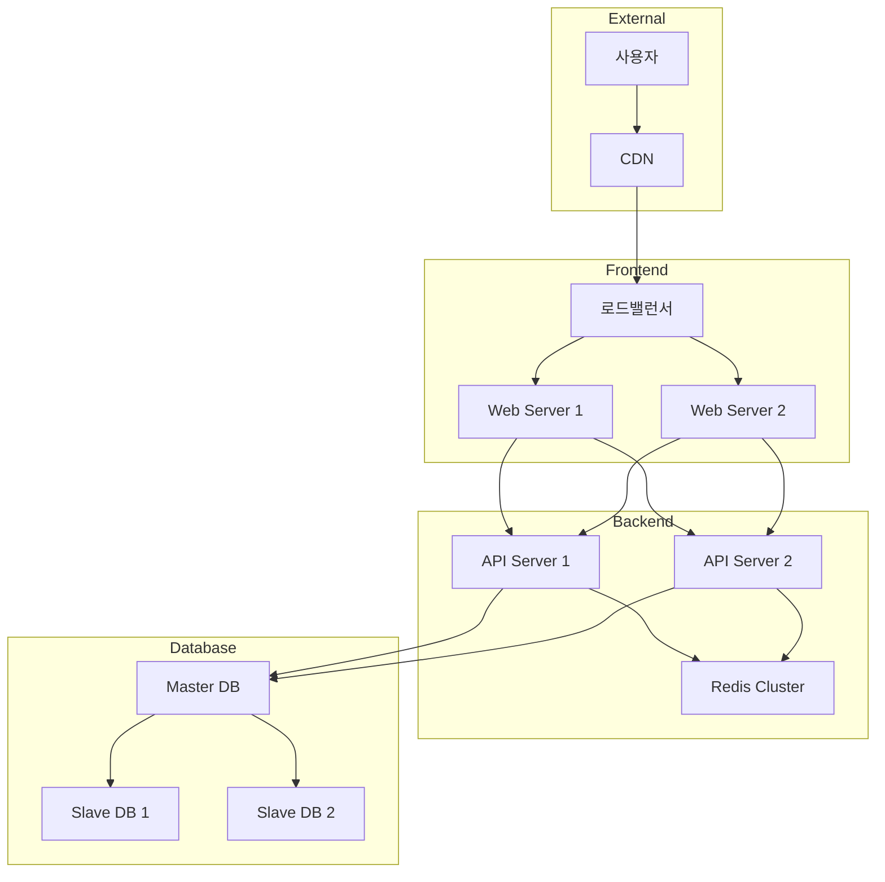

# 시스템 구성도 [System Architecture]

## 1. 전체 시스템 구성

## 2. 서버 사양
| 구분 | 수량 | CPU | Memory | Storage |
|------|------|-----|---------|----------|
| Web Server | 2 | 4Core | 16GB | 200GB |
| API Server | 2 | 8Core | 32GB | 500GB |
| DB Server | 3 | 16Core | 64GB | 2TB |