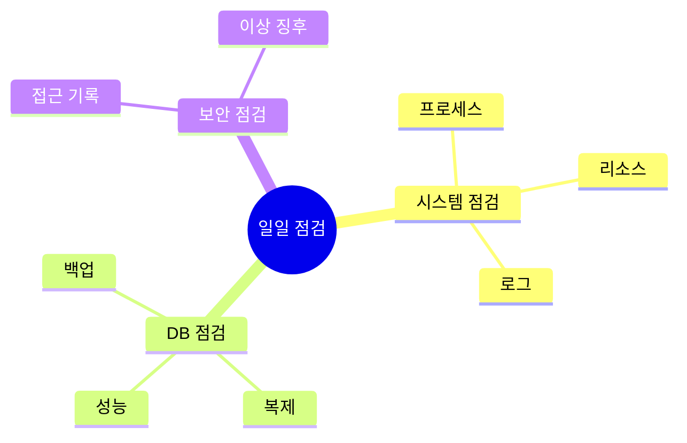
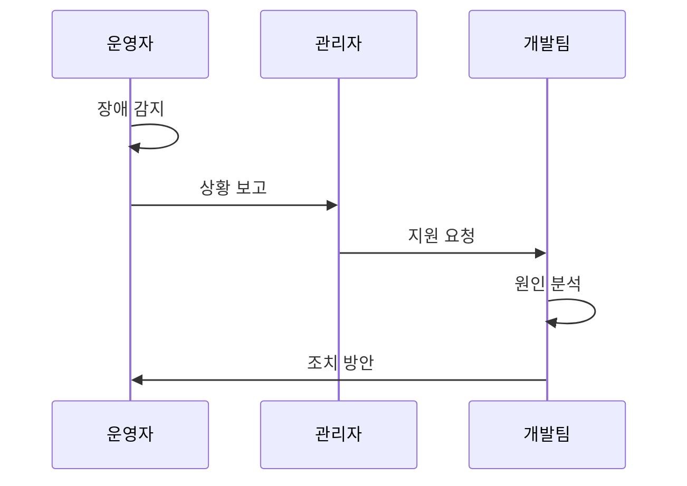

# 시스템 운영 매뉴얼 [System Operation Manual]

## 1. 일상 운영
### 1.1. 점검 항목

```mermaid
mindmap
    root((일일 점검))
        시스템 점검
            프로세스
            리소스
            로그
        DB 점검
            백업
            복제
            성능
        보안 점검
            접근 기록
            이상 징후
```

### 1.2. 장애 대응

```mermaid
sequenceDiagram
    participant 운영자
    participant 관리자
    participant 개발팀
   
    운영자->>운영자: 장애 감지
    운영자->>관리자: 상황 보고
    관리자->>개발팀: 지원 요청
    개발팀->>개발팀: 원인 분석
    개발팀->>운영자: 조치 방안
```
