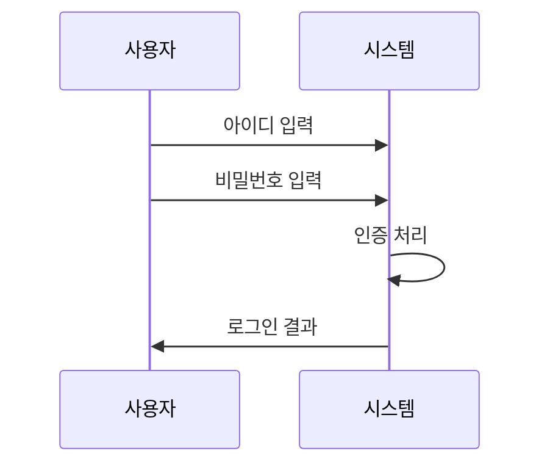
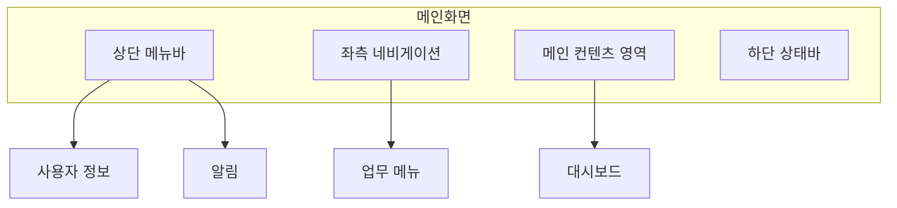
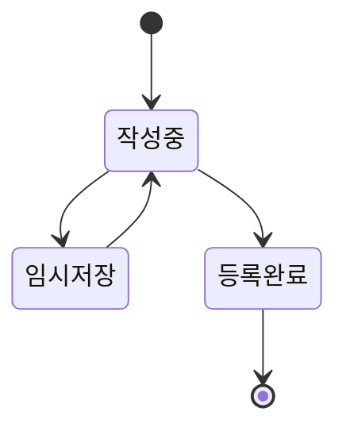
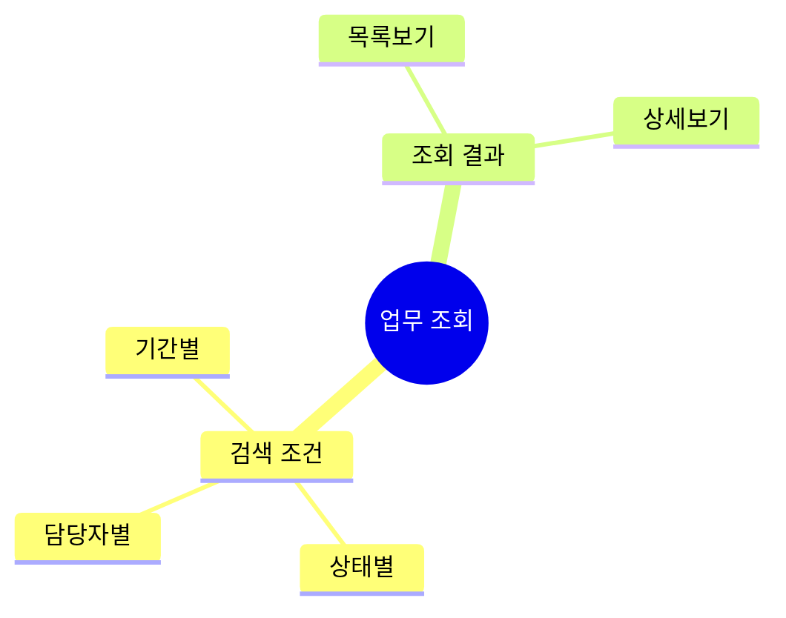
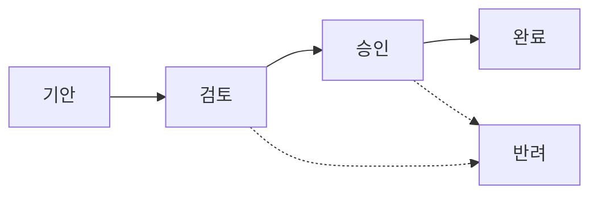
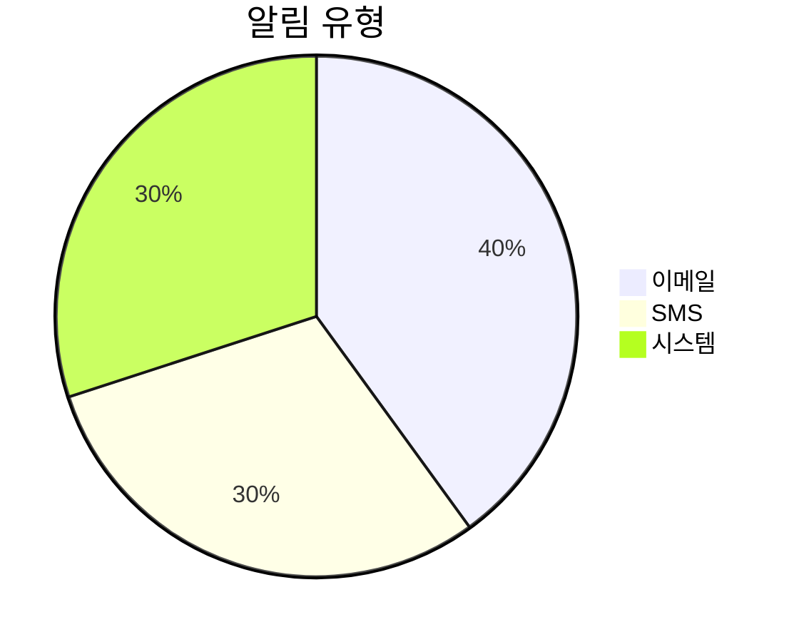
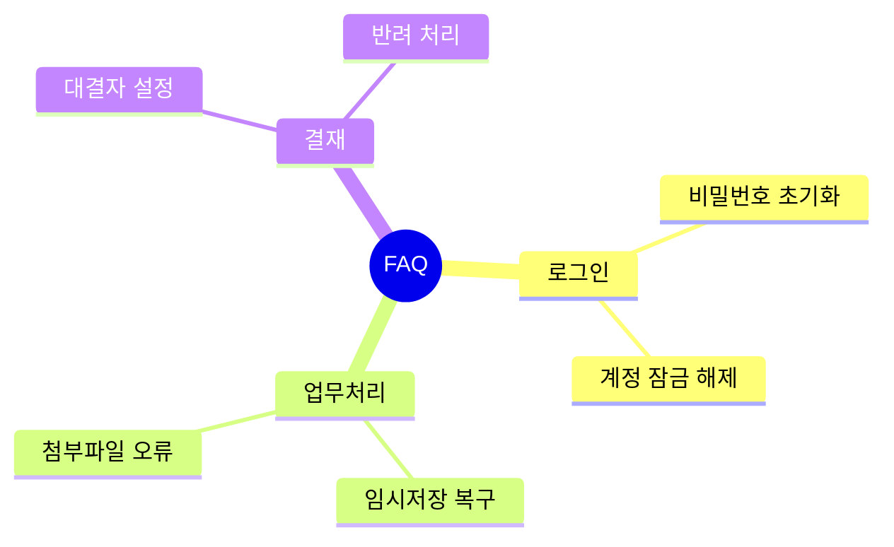
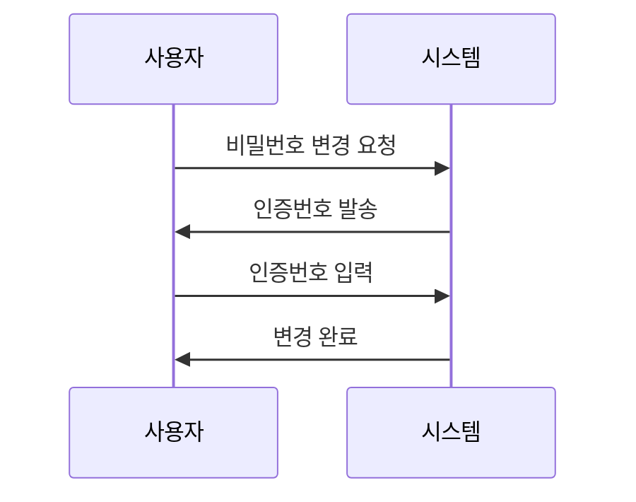

# 사용자 매뉴얼 [User Manual]

## 문서 정보(Document Information)
| 항목 | 내용 |
|------|------|
| 시스템명 | 통합 업무 관리 시스템 |
| 버전 | v2.0.0 |
| 작성일 | 2024-03-15 |
| 작성자 | 홍길동 |

## 1. 개요(Overview)
### 1.1. 매뉴얼 목적(Purpose)
본 매뉴얼은 통합 업무 관리 시스템의 사용자가 시스템을 효율적으로 활용할 수 있도록 작성되었습니다.

### 1.2. 시스템 구성(System Configuration)

## 2. 시작하기(Getting Started)
### 2.1. 시스템 접속(System Access)
1. 웹브라우저 실행 (권장: Chrome, Edge 최신 버전)
2. 시스템 URL 접속: https://example.com
3. 로그인 정보 입력

### 2.2. 로그인 화면(Login Screen)

## 3. 메인 화면(Main Screen)
### 3.1. 화면 구성(Screen Layout)

### 3.2. 주요 기능(Main Features)
| 메뉴 | 기능 설명 | 접근 권한 |
|------|-----------|-----------|
| 대시보드 | 업무 현황 조회 | 전체 사용자 |
| 업무관리 | 업무 등록/조회 | 일반 사용자 |
| 결재관리 | 결재 처리 | 승인권자 |

## 4. 업무 처리(Task Processing)
### 4.1. 업무 등록(Task Registration)

#### 4.1.1. 업무 등록 화면
1. 메뉴 > 업무관리 > 업무등록 선택
2. 필수 항목 입력
   - 제목
   - 업무구분
   - 처리기한
   - 내용
3. 첨부파일 등록 (필요시)
4. [저장] 버튼 클릭

### 4.2. 업무 조회(Task Search)

## 5. 결재 처리(Approval Process)
### 5.1. 결재 흐름(Approval Flow)

### 5.2. 결재 처리 방법(Approval Method)
| 단계 | 처리 방법 | 주의사항 |
|------|-----------|----------|
| 기안 | 결재 상신 | 필수 항목 확인 |
| 검토 | 내용 검토 후 승인/반려 | 검토의견 작성 |
| 승인 | 최종 승인/반려 | 결재의견 작성 |

## 6. 부가 기능(Additional Features)
### 6.1. 알림 설정(Notification Settings)

### 6.2. 개인화 설정(Personalization)
| 설정 항목 | 설정 값 | 설명 |
|-----------|---------|------|
| 테마 | Light/Dark | 화면 테마 설정 |
| 메뉴 구성 | 기본/간편 | 메뉴 표시 방식 |
| 알림 수신 | 켜기/끄기 | 알림 수신 여부 |

## 7. 문제 해결(Troubleshooting)
### 7.1. 자주 묻는 질문(FAQ)

### 7.2. 오류 해결(Error Resolution)
| 오류 현상 | 원인 | 해결 방법 |
|-----------|------|-----------|
| 로그인 실패 | 비밀번호 오류 | 비밀번호 초기화 요청 |
| 화면 로딩 오류 | 캐시 문제 | 브라우저 캐시 삭제 |
| 첨부파일 오류 | 용량 초과 | 파일 크기 확인 |

## 8. 보안 관리(Security Management)
### 8.1. 비밀번호 관리(Password Management)

### 8.2. 보안 주의사항(Security Precautions)
- 비밀번호 정기 변경 (90일)
- 공용 PC 사용 후 로그아웃
- 중요 문서 다운로드 기록 관리

## 9. 부록(Appendix)
### 9.1. 단축키 목록(Shortcut Keys)
| 단축키 | 기능 | 비고 |
|--------|------|------|
| Ctrl + N | 새 업무 등록 | - |
| Ctrl + S | 임시 저장 | - |
| F5 | 화면 새로고침 | - |

### 9.2. 용어 설명(Glossary)
| 용어 | 설명 | 비고 |
|------|------|------|
| 전자결재 | 문서의 결재를 전자적으로 처리 | - |
| 대결 | 결재권자 부재 시 대신 결재 | - |
| 합의 | 관련 부서의 동의 절차 | - |